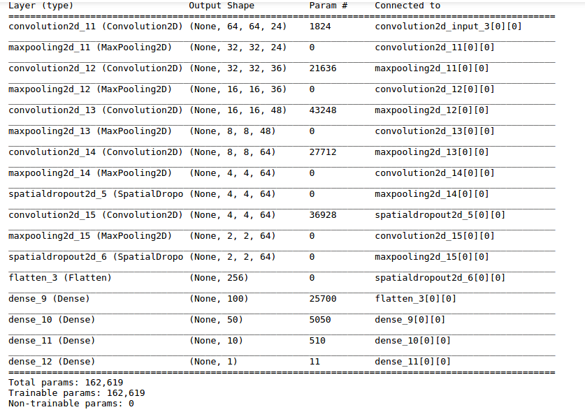
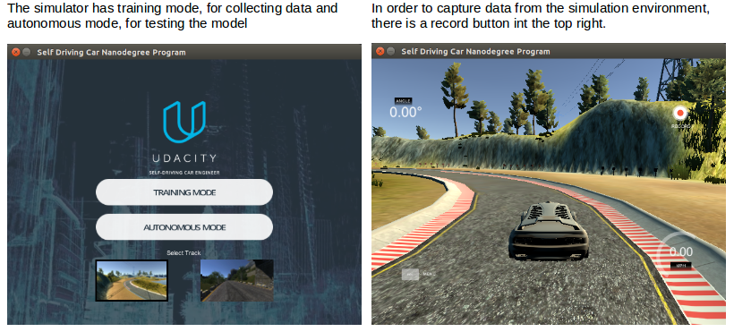
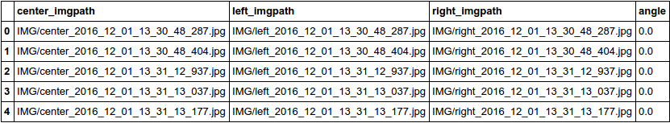
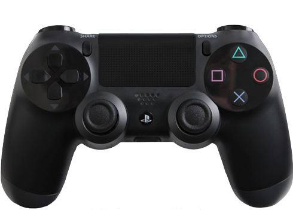
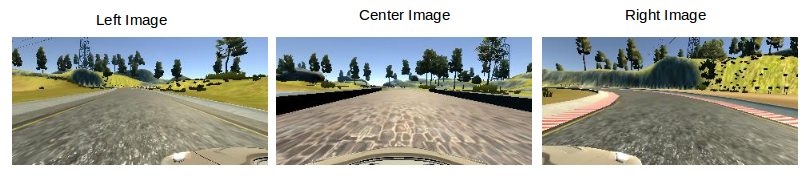
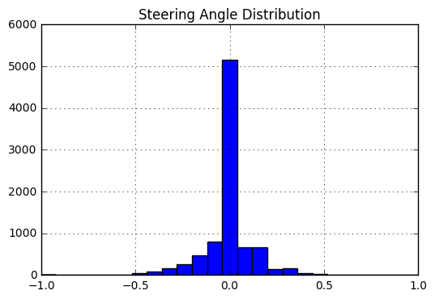
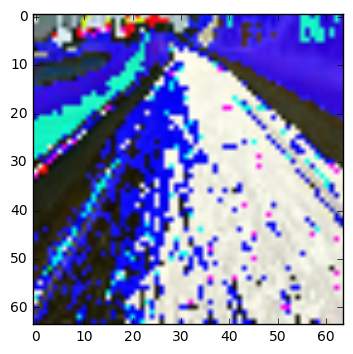

<left>[](http://www.udacity.com/drive)</left>

# Behavioral Learning - A Deep Neural Network Drives a Car 

## Overview

In this project, a trained car drives in a simulated environment by cloning the behavior as seen during training mode.  Using Tensorflow and Keras, a deep learning neural network was designed to output steering angles in the simulation. Refer to the following video for a demonstration.

[Demo Video](https://youtu.be/muCvfm7XZPc)

## Dependencies

Install Python Dependencies with Anaconda (conda install …)
* numpy
* flask-socketio
* eventlet
* pillow
* h5py

Install Python Dependencies with pip (pip install ...)
* keras

## Files
* `model.py` - The script used to create and train the model.
* `drive.py` - The script to drive the car.
* `model.json` - The model architecture.
* `model.h5` - The model weights.
* `retrain_model.py` - A retraining script for new data.

## Udacity Simulator

Udacity created a simulator based on the Unity engine that uses real game physics to create a close approximation to real driving.

### Download

* [Linux](https://d17h27t6h515a5.cloudfront.net/topher/2016/November/5831f0f7_simulator-linux/simulator-linux.zip)
* [macOS](https://d17h27t6h515a5.cloudfront.net/topher/2016/November/5831f290_simulator-macos/simulator-macos.zip)
* [Windows 32-bit](https://d17h27t6h515a5.cloudfront.net/topher/2016/November/5831f4b6_simulator-windows-32/simulator-windows-32.zip)
* [Windows 64-bit](https://d17h27t6h515a5.cloudfront.net/topher/2016/November/5831f3a4_simulator-windows-64/simulator-windows-64.zip)

# Network

## Approach

The car simulation is designed to take in a video from a left, front and center camera in conjunction with a measured steering angle of the car. The videos are split into still frames, and used to train a regression model with the target value being the steering angle. As Convolution Neural Networks do very well in image classification, they are used in this problem.

In order to design the network, I first did research on what was previously done. The solution documented in the [NVIDIA Paper](http://images.nvidia.com/content/tegra/automotive/images/2016/solutions/pdf/end-to-end-dl-using-px.pdf), in which raw pixels are mapped steering commands, is very similar to our problem. The Nvidia architecture is relatively small with only 9 layers, meaning that design iteration can take place quickly. 

I also considered using transfer learning using ImageNet weights along with a network such as VGG, ResNet, or GoogLeNet. Even though these massively powerful networks are built for classification, I can leverage the previously trained weights in the starting layers and replace the final layer(s) with a single output to make a regression classifier.  However, images contained in ImageNet are very different than those from the Udacity simulator. In my experience, a network trained on different images, though it may detect many of the same features in a new image set, will perform worse than a network trained from scratch.

I opted to use a smaller network, trained on simulator data from scratch.


## Architecture

My final architecture is based on the network depicted in [NVIDIA Paper](http://images.nvidia.com/content/tegra/automotive/images/2016/solutions/pdf/end-to-end-dl-using-px.pdf). Since we are working with a regression problem, the output layer is a single continuous value, using the `tanh` activation function. The `tanh` activation function bounds the steering angle output by [-1,1] ensuring the car won't make turns that are too sharp.

The final architecture is given below:



### Activation

For activations, after reading the [paper on ELU Activations](https://arxiv.org/pdf/1511.07289v1.pdf) I decided to use ELUs. ELU activations offer the same protection against vanishing gradient as RELU, and in addition, ELUs protect against the ['dying neuron problem](https://www.quora.com/What-is-the-dying-ReLU-problem-in-neural-networks).

### Dropout

I experimented with adding dropout to reduce over-fitting of the model. At first I added a small amount of dropout to every layer of the network. I found that the model began to under-fit (i.e the training score and validation error were the same, but quite high). I removed dropout layer by layer until both the training, and validation scores were low and similar (roughly 0.0020 mean square error).

## Data Collection

In order for the car to drive in autonomous mode, the first step is to capture data from the simulator to use to train the neural network.



The data generated is shown in the following table:



In order to capture smooth steering angles, a PS4 controller was used in the simulator. Using the arrow keys on a laptop resulted in choppy discreet steering angles that were unsuitable for training.





## Using Left, Right and Center Images.


Using the left, right and center image was a easy way to train the car how to correct itself. It can be assumed that their view shows the car too much on the left/right compared to the center images. These images were fed into the model with an small adjustment to their steering angle that corresponds to the car steering back to the center. This is described in the [NVIDIA Paper](http://images.nvidia.com/content/tegra/automotive/images/2016/solutions/pdf/end-to-end-dl-using-px.pdf) This was a great parameter for the final tuning of the model as it directly corresponded to how much the car would zig zag across the road.



## Image Filtering

As the training track had mostly left turns, the training data set was fairly imbalanced. This can be seen by the following distribution of steering angles.



In order to get around this, data that had a steering angle between [-0.1, 0.1] was randomly dropped 66% of the time.


# Training


The network was trained on 20k images from the left, center and right camera, along with their steering angles. The data was then split into 90% training and 10% validation sets. For testing, the autonomous car was allowed to run on the track, and the results observed.


## Image Generator

The entire set of images used for training would consume a large amount of memory.  A python generator is leveraged so that only a single batch is contained in memory at a time. Each of the files paths are sent to the `get_generator` function and a tuple containing the batch images and angles are returned.

## Image Preprocessing

Image preprocessing is done on the images as they are generated.

First the image is cropped above the horizon to reduce the amount of features fed into the network.  Next the image is resized to further reduce features. The final size of the image is 62x63x3.  Finally normalization is applied to each mini-batch.  This helps keep weight values small, improving numerical stability. The following shows the results of the preprocessing.



## Model re-training

The script `retrain_model.py` loads the existing model and trains it on any new data that may have been collected. This allowed for on the fly training of the model in problem areas. Even after the preprocessing, the whole dataset took roughly 2300 second to train on my laptop. Using a AWS instance sped this up substantially (roughly 100s); however, it was a pain go back and forth to load new data to AWS and download models when all I needed was small adjustment.


## AWS EC2 Instance

As my laptop does not possess the necessary horsepower to train the initial network, a AWS EC2 GPU instance is used. The specific instance used is the `g2.2xlarge` instance with the following properties:

| Model      | GPUs | vCPU | Mem (GiB) | SSD Storage (GB) |
|------------|------|------|-----------|------------------|
| g2.2xlarge | 1    | 8    | 15        | 1 x 60           |


# Running the model

Once the network is trained, the model definition as well as the trained weights are saved so that the autonomous driving server can reconstruct the network and make predictions given the live camera stream.

We can run the simulator in autonomous mode and start the driver server (the brain) using:

```
python drive.py model.json
```

## Controlling for Speed

As my laptop is a 2009 Macbook pro without a decent GPU, even running the simulation was challenging. The images were being fed into the network faster than it could spit out answers. In order to get around this, a simple proportional controlled was applied to the throttle. As the steering angle increased, then throttle was reduced, so the car would have enough time to make predictions as it was turning.


